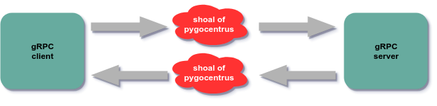

# pygocentrus

Todos os seus projetos fluem calmamente no seu computar e tudo parece funcionar até ir para o ambiente de produção?

O projeto **pygocentrus** adiciona algumas piranhas causadoras de caos no fluxo do sistema e tenta causar alguns erros
típicos do ambiente de produção dentro do seu ambiente de desenvolvimento.

### Contexto

Basicamente, eu recebi uma missão simples, devemos colocar o [gRPC](https://grpc.io/) para funcionar na empresa, porém, 
ninguém aqui tem experiência suficiente com ele e nós necessitamos saber o que esperar dele quando ele falhar. 
 
### Exemplo de uso e teste

No meu [github](https://github.com/helmutkemper) tem um projeto com os meus testes envolvendo 
[gRPC](https://github.com/helmutkemper/gRPC) e dentro dele tem a pasta 
[1_helloWord](https://github.com/helmutkemper/gRPC/tree/master/1_helloWord) com o exemplo mais simples de todos, o envio
de uma simples mensagem de texto e a confirmação de recebimento.

A ideia basica é interferir na comunicação de rede e causar erros propositais, como na imagem abaixo:



Dentro dessa pasta, você vai encontrar os arquivos: 

**.env**:
```

grpc_port=50051
pygocentrus_in_port=50051
pygocentrus_out_port=50051
pygocentrus_ip=172.28.0.2
pygocentrus_out_ip=172.28.0.4
grpc_server_ip=172.28.0.5
subnet_ip_mask=172.28.0.0/16

```

**docker-compose.yml**:
```yaml

version: '3.7'

services:

  pygocentrus:
    build:
      context: ../
      dockerfile: ./pygocentrus/Dockerfile
    command: go run main.go
    working_dir: /go/src/app
    environment:
      - IN_PORT=${pygocentrus_in_port}
      - OUT_ADDR=${grpc_server_ip}
      - OUT_PORT=${pygocentrus_out_port}
    networks:
      grpc_net:
        ipv4_address: ${pygocentrus_ip}

  golang-grpc-server:
    build:
      context: ../
      dockerfile: ./1_helloWord/server/Dockerfile
    command: go run main.go
    working_dir: /go/src/app
    environment:
      - PORT=${grpc_port}
    networks:
      grpc_net:
        ipv4_address: ${grpc_server_ip}
    depends_on:
      - pygocentrus

  golang-grpc-client:
    build:
      context: ../
      dockerfile: ./1_helloWord/client/Dockerfile
    command: go run main.go
    working_dir: /go/src/app
    environment:
      - ADDR=${pygocentrus_ip}
      - PORT=${grpc_port}
      - NAME=gRPC Dev
    networks:
      grpc_net:
    depends_on:
      - pygocentrus
      - golang-grpc-server

networks:
  grpc_net:
    ipam:
      driver: default
      config:
        - subnet: ${subnet_ip_mask}

```

Como você pode perceber, a comunicação entre o servidor gRPC e o cliente gRPC foi desviada para passar por um cardume de
pygocentrus famintas, o que vai causar erros em algumas tentativas de comunicação.

Na prática, você vai baixar o repositório e entrar no diretório **1_helloWord** e depois subir o **docker-compose** como
no exemplo abaixo

```bash

./1_helloWord$ docker-compose up

```

Caso tudo ocorra normal e sem erros, você deve ver uma saída como esta:

```bash

Starting 1_helloword_pygocentrus_1 ... done
Starting 1_helloword_golang-grpc-server_1 ... done
Starting 1_helloword_golang-grpc-client_1 ... done
Attaching to 1_helloword_pygocentrus_1, 1_helloword_golang-grpc-server_1, 1_helloword_golang-grpc-client_1
pygocentrus_1         | pygocentrus listen(:50051)
pygocentrus_1         | pygocentrus dial(:172.28.0.5:50051)
golang-grpc-server_1  | gRPC server listen(:50051)
golang-grpc-client_1  | gRPC client dial(172.28.0.2:50051)
golang-grpc-server_1  | 2019/03/04 15:59:28 Received: gRPC Dev
golang-grpc-client_1  | 2019/03/04 15:59:28 Greeting: Hello gRPC Dev
1_helloword_golang-grpc-client_1 exited with code 0

```

Ou, caso tudo ocorra normal e com erros devido ao ataque de pygocentrus, você deve ver uma saída como esta:

> pygocentrus_1 | 2019/03/04 17:19:56 pygocentrus attack

```bash

Starting 1_helloword_pygocentrus_1 ... done
Starting 1_helloword_golang-grpc-server_1 ... done
Starting 1_helloword_golang-grpc-client_1 ... done
Attaching to 1_helloword_pygocentrus_1, 1_helloword_golang-grpc-server_1, 1_helloword_golang-grpc-client_1
pygocentrus_1         | pygocentrus listen(:50051)
pygocentrus_1         | pygocentrus dial(:172.28.0.5:50051)
golang-grpc-server_1  | gRPC server listen(:50051)
golang-grpc-client_1  | gRPC client dial(172.28.0.2:50051)
pygocentrus_1         | 2019/03/04 17:19:56 pygocentrus attack
golang-grpc-client_1  | 2019/03/04 17:19:56 could not greet: rpc error: code = Unavailable desc = all SubConns are in TransientFailure, latest connection error: <nil>
1_helloword_golang-grpc-client_1 exited with code 0

```

